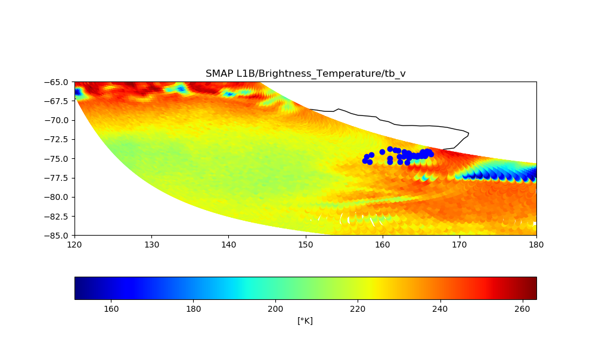

# Satellite_Data_Plot

Description:
Samples of satellite data graphics are presented in this repository using the Geopandas and Basemap libraries

Basemap plot: 

  
 

Geopandas:

  
 

Dependences:

    python - Geopandas
    python - Basemap

Pages source:

http://geopandas.org/index.html

https://basemaptutorial.readthedocs.io/en/latest/index.html
